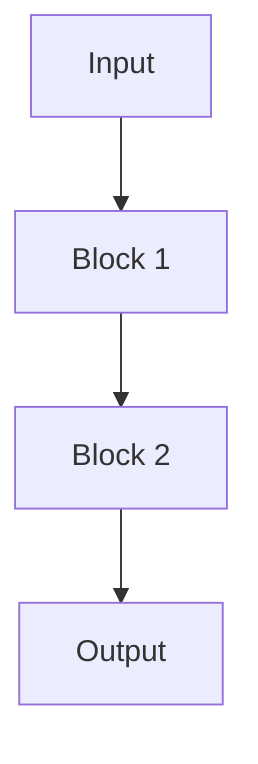

# {algorithm_name}

## Summary

- What problem does this algorithm solve?
- What is the core idea?
- What is the main limitation?

## Background

Only include the minimum background needed to understand the algorithm.

## Flowchart

## Block-By-Block Explanation

### Block 1

Explain function, input/output, and why it is needed in no more than three sentences.

### Block 2

Explain function, input/output, and why it is needed in no more than three sentences.

## Mathematical Explanation

List the key stage signals only.

## Pros And Cons

| Pros | Cons |
|---|---|
| Example pro | Example con |

## Trade-Offs

| Dimension | Gain | Cost |
|---|---|---|
| Example | Better X | Worse Y |

## Current Status / Evolution

| Algorithm | Domain | Strength | Limitation |
|---|---|---|---|
| This algorithm | Example | Example | Example |

## Appendix

Add only if the user explicitly requests expansion.
